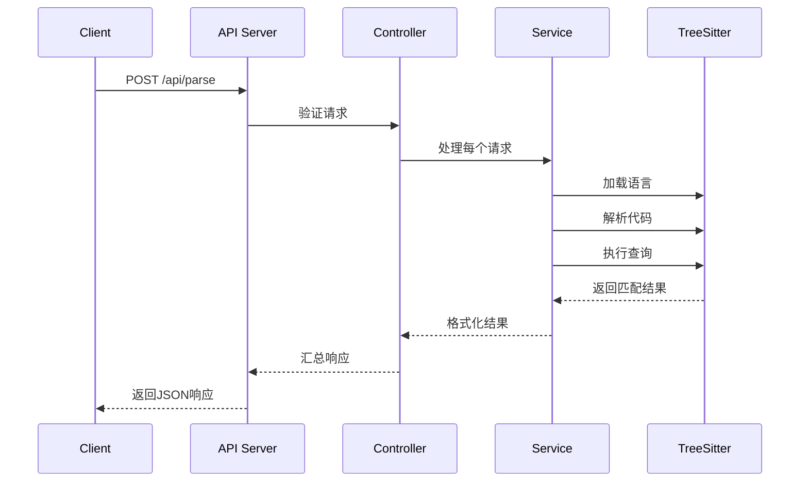
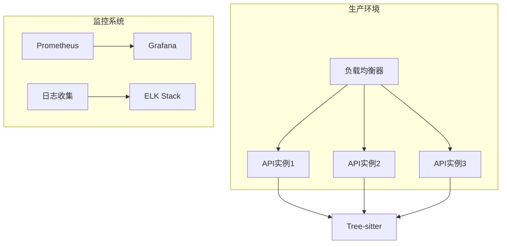

# REST API 设计文档

## 设计原则

### 1. 一致性原则
- 所有端点使用统一的JSON格式
- 错误响应格式标准化
- 使用一致的命名约定

### 2. 可扩展性
- 支持批量处理多个请求
- 易于添加新的编程语言支持
- 模块化设计便于功能扩展

### 3. 性能优化
- 重用Parser实例减少初始化开销
- 支持并发处理请求
- 合理的默认超时设置

## 请求流程



## 数据结构设计

### 请求数据结构
```typescript
interface ParseRequest {
    language: string;      // 编程语言标识符
    code: string;          // 要分析的代码
    query?: string;        // 单个查询规则（可选）
    queries?: string[];    // 多个查询规则（可选）
}
```

### 响应数据结构
```typescript
interface ParseResponse {
    results: ParseResult[]; // 每个请求的结果数组
}

interface ParseResult {
    success: boolean;      // 处理是否成功
    matches: MatchResult[]; // 匹配结果
    errors: string[];      // 错误信息
}

interface MatchResult {
    captureName: string;   // 捕获名称
    type: string;          // 节点类型
    text: string;          // 匹配文本
    startPosition: Position; // 起始位置
    endPosition: Position;   // 结束位置
}

interface Position {
    row: number;          // 行号（0-based）
    column: number;        // 列号（0-based）
}
```

## 错误处理策略

### 1. 输入验证错误（400）
- 缺失必需字段
- 无效的语言标识符
- 格式错误的JSON

### 2. 语言不支持错误（404）
- 请求的语言不在支持列表中

### 3. 内部服务器错误（500）
- Tree-sitter解析失败
- 内存不足等系统错误

### 错误响应格式
```json
{
    "error": "错误描述",
    "details": "详细错误信息",
    "requestId": "请求标识符"
}
```

## 性能考虑

### 1. 内存管理
- 重用Parser实例
- 及时释放Tree-sitter资源
- 限制单个请求大小

### 2. 并发处理
- 使用Promise.all并行处理请求
- 限制并发数量防止资源耗尽

### 3. 缓存策略
- 缓存已加载的语言grammar
- 实现连接池管理Parser实例

## 安全考虑

### 1. 输入验证
- 验证语言标识符在白名单内
- 限制代码大小防止DoS攻击
-  sanitize用户输入

### 2. CORS配置
- 配置适当的CORS策略
- 限制允许的源

### 3. 速率限制
- 实现请求速率限制
- 防止滥用API

## 监控和日志

### 1. 请求日志
- 记录每个请求的基本信息
- 记录处理时间和结果状态

### 2. 性能指标
- 响应时间统计
- 错误率监控
- 资源使用情况

### 3. 健康检查
- 实现/health端点
- 监控服务状态

## 版本管理

### 版本策略
- 使用URL版本控制（/api/v1/parse）
- 向后兼容的变更
- 弃用策略和迁移指南

## 测试策略

### 1. 单元测试
- 测试单个组件功能
- 模拟Tree-sitter行为

### 2. 集成测试
- 测试完整API流程
- 验证端到端功能

### 3. 性能测试
- 负载测试并发处理能力
- 压力测试资源使用

## 部署架构



## 扩展路线图

### 短期功能
- [ ] 添加更多编程语言支持
- [ ] 实现语法高亮端点
- [ ] 添加代码格式化功能

### 中期功能
- [ ] 实现WebSocket实时更新
- [ ] 添加身份验证和授权
- [ ] 支持自定义grammar上传

### 长期功能
- [ ] 分布式处理架构
- [ ] 机器学习增强的代码分析
- [ ] 集成CI/CD流水线

## 兼容性考虑

### 向后兼容
- 不删除现有字段
- 可选的新字段
- 版本化API端点

### 向前兼容
- 宽松的JSON解析
- 忽略未知字段
- 默认值处理

## 文档标准

### API文档
- OpenAPI/Swagger规范
- 示例代码片段
- 错误代码说明

### 开发者指南
- 快速开始教程
- 最佳实践指南
- 故障排除指南