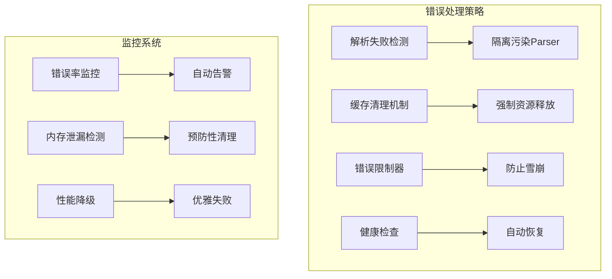

# 解析失败处理和缓存管理方案

## 问题分析

Tree-sitter在大量解析失败时可能出现：
1. **内部缓存增长**：失败的解析可能被缓存导致内存泄漏
2. **Parser状态污染**：失败的解析可能影响parser的后续使用
3. **资源未释放**：错误情况下资源释放不完整

## 解决方案架构



## 具体实现方案

### 1. 解析失败检测和隔离

```typescript
// src/api/services/TreeSitterService.ts
export class TreeSitterService {
    private errorCount: Map<string, number> = new Map(); // 语言级别的错误计数
    private contaminatedParsers: Set<Parser> = new Set(); // 被污染的parser

    async processRequest(request: ParseRequest): Promise<ParseResult> {
        const { language, code } = request;
        
        // 检查错误率限制
        if (this.isLanguageOverErrorLimit(language)) {
            return {
                success: false,
                matches: [],
                errors: [`Language ${language} is temporarily disabled due to high error rate`]
            };
        }

        try {
            // 解析代码
            const result = await this.safeParse(language, code, request);
            this.resetErrorCount(language);
            return result;

        } catch (error) {
            this.incrementErrorCount(language);
            return this.handleParseError(error, language);
        }
    }

    private async safeParse(language: string, code: string, request: ParseRequest) {
        const parser = this.parserPool.getParser(language);
        
        try {
            const languageModule = this.languageModules.get(language);
            parser.setLanguage(languageModule);
            
            const tree = this.treeManager.createTree(parser, code);
            
            // 验证解析结果
            if (!tree || !tree.rootNode) {
                throw new Error('Parse tree is invalid');
            }

            // 执行查询
            const result = await this.executeQueries(tree, request);
            
            return result;

        } finally {
            // 检查parser是否被污染
            if (this.contaminatedParsers.has(parser)) {
                this.parserPool.destroyParser(parser); // 彻底销毁
                this.contaminatedParsers.delete(parser);
            } else {
                this.parserPool.releaseParser(language, parser);
            }
        }
    }
}
```

### 2. 错误率限制和自动禁用

```typescript
// src/api/services/ErrorRateLimiter.ts
export class ErrorRateLimiter {
    private errorCounts: Map<string, number> = new Map();
    private errorTimestamps: Map<string, number[]> = new Map();
    private disabledLanguages: Set<string> = new Set();

    // 错误率限制配置
    private readonly MAX_ERRORS_PER_MINUTE = 100;
    private readonly DISABLE_DURATION = 5 * 60 * 1000; // 5分钟

    incrementErrorCount(language: string) {
        const count = (this.errorCounts.get(language) || 0) + 1;
        this.errorCounts.set(language, count);

        // 记录错误时间戳
        const timestamps = this.errorTimestamps.get(language) || [];
        timestamps.push(Date.now());
        this.errorTimestamps.set(language, timestamps);

        // 清理过期时间戳
        this.cleanOldTimestamps(language);

        // 检查是否超过限制
        if (this.getErrorRate(language) > this.MAX_ERRORS_PER_MINUTE) {
            this.disableLanguage(language);
        }
    }

    isLanguageOverErrorLimit(language: string): boolean {
        return this.disabledLanguages.has(language);
    }

    disableLanguage(language: string) {
        this.disabledLanguages.add(language);
        
        // 定时恢复
        setTimeout(() => {
            this.disabledLanguages.delete(language);
            this.errorCounts.set(language, 0);
            this.errorTimestamps.set(language, []);
        }, this.DISABLE_DURATION);
    }

    getErrorRate(language: string): number {
        const timestamps = this.errorTimestamps.get(language) || [];
        const oneMinuteAgo = Date.now() - 60 * 1000;
        return timestamps.filter(ts => ts > oneMinuteAgo).length;
    }
}
```

### 3. 缓存清理和强制释放

```typescript
// src/api/services/CacheCleaner.ts
export class CacheCleaner {
    private lastCleanupTime = 0;
    private readonly CLEANUP_INTERVAL = 30 * 1000; // 30秒

    // 定期清理Tree-sitter内部缓存
    async cleanupTreeSitterCache() {
        const now = Date.now();
        if (now - this.lastCleanupTime < this.CLEANUP_INTERVAL) {
            return;
        }

        this.lastCleanupTime = now;
        
        try {
            // 强制垃圾回收
            MemoryUtils.forceGarbageCollection();
            
            // 清理parser池中的可能缓存
            this.cleanupParserPool();
            
            // 监控内存泄漏
            this.monitorMemoryLeaks();

        } catch (error) {
            console.error('Cache cleanup failed:', error);
        }
    }

    private cleanupParserPool() {
        // 遍历所有parser，重置状态
        this.parserPool.cleanup();
    }

    private monitorMemoryLeaks() {
        const memoryUsage = process.memoryUsage();
        const heapUsed = memoryUsage.heapUsed;
        
        // 检测内存增长趋势
        if (this.isMemoryLeaking(heapUsed)) {
            console.warn('Potential memory leak detected');
            this.emergencyCleanup();
        }
    }

    private isMemoryLeaking(currentHeap: number): boolean {
        // 实现内存泄漏检测逻辑
        // 比较当前内存使用与基线
        return false; // 简化实现
    }

    emergencyCleanup() {
        // 彻底清理所有资源
        this.treeManager.emergencyCleanup();
        this.parserPool.cleanup();
        
        // 强制GC
        MemoryUtils.forceGarbageCollection();
    }
}
```

### 4. 请求级别资源保障

```typescript
// src/api/middleware/resourceGuard.ts
export const resourceGuard = (service: TreeSitterService) => {
    return async (req: Request, res: Response, next: NextFunction) => {
        const requestId = generateRequestId();
        
        try {
            // 设置资源超时
            req.setTimeout(30000, () => {
                this.handleTimeout(requestId, req);
            });

            // 监控内存使用
            const startMemory = process.memoryUsage();
            
            await next();
            
            // 检查内存增长
            const endMemory = process.memoryUsage();
            this.checkMemoryGrowth(requestId, startMemory, endMemory);

        } catch (error) {
            // 确保资源释放
            service.emergencyCleanup();
            next(error);
        }
    };
};
```

### 5. 健康检查和自动恢复

```typescript
// src/api/controllers/healthController.ts
export const healthCheck = (service: TreeSitterService) => {
    return async (req: Request, res: Response) => {
        const memoryUsage = process.memoryUsage();
        const errorRates = service.getErrorRates();
        
        const healthStatus = {
            status: 'healthy',
            memory: {
                rss: Math.round(memoryUsage.rss / 1024 / 1024),
                heap: Math.round(memoryUsage.heapUsed / 1024 / 1024)
            },
            errorRates: Object.fromEntries(errorRates),
            disabledLanguages: Array.from(service.getDisabledLanguages()),
            timestamp: new Date().toISOString()
        };

        // 自动恢复检查
        if (memoryUsage.heapUsed > 500 * 1024 * 1024) {
            service.emergencyCleanup();
            healthStatus.status = 'recovering';
        }

        res.json(healthStatus);
    };
};
```

## 配置和管理

### 环境变量配置
```typescript
export const config = {
    // 错误处理配置
    maxErrorsPerMinute: process.env.MAX_ERRORS_PER_MINUTE || 100,
    disableDuration: process.env.DISABLE_DURATION || 300000,
    
    // 内存管理配置
    memoryCleanupInterval: process.env.CLEANUP_INTERVAL || 30000,
    memoryThreshold: process.env.MEMORY_THRESHOLD || 500,
    
    // 超时配置
    requestTimeout: process.env.REQUEST_TIMEOUT || 30000
};
```

### 监控和告警

```typescript
// 监控错误率
setInterval(() => {
    const errorRates = service.getErrorRates();
    Object.entries(errorRates).forEach(([language, rate]) => {
        if (rate > config.maxErrorsPerMinute * 0.8) {
            alertSystem.sendWarning(`High error rate for ${language}: ${rate}/min`);
        }
    });
}, 60000); // 每分钟检查一次
```

## 测试策略

### 错误注入测试
```typescript
describe('Error Handling', () => {
    it('应该正确处理大量解析失败', async () => {
        // 注入大量无效代码
        const requests = Array(1000).fill(0).map(() => ({
            language: 'javascript',
            code: 'invalid code $$$',
            query: '(function_declaration) @func'
        }));

        // 验证错误率限制生效
        const results = await service.processBatch(requests);
        expect(results.filter(r => !r.success).length).toBeLessThan(100);
    });
});
```

## 总结

这套方案提供了：

1. **错误检测和隔离**：及时发现和处理解析失败
2. **错误率限制**：防止错误雪崩和资源耗尽
3. **缓存清理**：定期清理Tree-sitter内部缓存
4. **资源保障**：确保即使失败也能释放资源
5. **自动恢复**：健康检查和自动恢复机制

通过这套方案，可以有效处理大量解析失败的情况，防止内存泄漏，确保服务的稳定性。