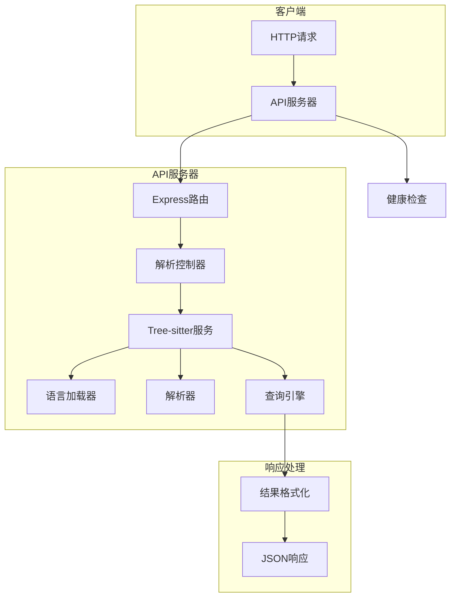

# REST API 实现技术方案

## 架构设计



## 文件结构

```
src/
├── api/
│   ├── server.ts                 # Express服务器入口
│   ├── routes/
│   │   ├── index.ts              # 路由注册
│   │   ├── parse.ts              # 解析路由
│   │   └── health.ts             # 健康检查路由
│   ├── controllers/
│   │   └── parseController.ts    # 解析控制器
│   ├── services/
│   │   └── treeSitterService.ts  # Tree-sitter服务
│   ├── types/
│   │   └── apiTypes.ts           # API类型定义
│   └── middleware/
│       ├── errorHandler.ts       # 错误处理
│       └── validation.ts         # 请求验证
└── index.ts                      # 应用入口点
```

## 核心组件

### 1. Express服务器 (server.ts)

```typescript
import express from 'express';
import cors from 'cors';
import bodyParser from 'body-parser';
import routes from './routes';

const app = express();
const PORT = process.env.PORT || 3000;

app.use(cors());
app.use(bodyParser.json({ limit: '10mb' }));
app.use('/api', routes);

app.listen(PORT, () => {
    console.log(`API服务器运行在端口 ${PORT}`);
});
```

### 2. 路由配置 (routes/index.ts)

```typescript
import { Router } from 'express';
import parseRouter from './parse';
import healthRouter from './health';

const router = Router();

router.use('/parse', parseRouter);
router.use('/health', healthRouter);

export default router;
```

### 3. 解析路由 (routes/parse.ts)

```typescript
import { Router } from 'express';
import { parseCode } from '../controllers/parseController';
import { validateParseRequest } from '../middleware/validation';

const router = Router();

router.post('/', validateParseRequest, parseCode);

export default router;
```

### 4. 解析控制器 (controllers/parseController.ts)

```typescript
import { Request, Response } from 'express';
import { treeSitterService } from '../services/treeSitterService';
import { ParseRequest } from '../types/apiTypes';

export const parseCode = async (req: Request, res: Response) => {
    try {
        const requests: ParseRequest[] = req.body.requests;
        const results = await Promise.all(
            requests.map(request => treeSitterService.processRequest(request))
        );
        
        res.json({ results });
    } catch (error) {
        res.status(500).json({ 
            error: 'Internal server error', 
            details: error.message 
        });
    }
};
```

### 5. Tree-sitter服务 (services/treeSitterService.ts)

```typescript
import { Parser } from 'web-tree-sitter';
import { getWasmLanguage, wasmLanguageLoader } from '../treeSitter';
import { ParseRequest, ParseResult } from '../types/apiTypes';

class TreeSitterService {
    private parser: Parser;

    constructor() {
        this.parser = new Parser();
    }

    async processRequest(request: ParseRequest): Promise<ParseResult> {
        try {
            const { language, code, query, queries = [] } = request;
            const wasmLanguage = getWasmLanguage(language);
            const lang = await wasmLanguageLoader.loadLanguage(extensionUri, wasmLanguage);
            
            this.parser.setLanguage(lang);
            const tree = this.parser.parse(code);

            const allQueries = query ? [query, ...queries] : queries;
            const matches = [];

            for (const q of allQueries) {
                const queryResult = lang.query(q);
                const queryMatches = queryResult.matches(tree.rootNode);
                
                matches.push(...queryMatches.flatMap(match => 
                    match.captures.map(capture => ({
                        captureName: capture.name,
                        type: capture.node.type,
                        text: capture.node.text,
                        startPosition: capture.node.startPosition,
                        endPosition: capture.node.endPosition
                    }))
                ));
            }

            return { success: true, matches, errors: [] };
        } catch (error) {
            return { 
                success: false, 
                matches: [], 
                errors: [error.message] 
            };
        }
    }
}

export const treeSitterService = new TreeSitterService();
```

### 6. 类型定义 (types/apiTypes.ts)

```typescript
export interface Position {
    row: number;
    column: number;
}

export interface MatchResult {
    captureName: string;
    type: string;
    text: string;
    startPosition: Position;
    endPosition: Position;
}

export interface ParseResult {
    success: boolean;
    matches: MatchResult[];
    errors: string[];
}

export interface ParseRequest {
    language: string;
    code: string;
    query?: string;
    queries?: string[];
}

export interface ParseResponse {
    results: ParseResult[];
}
```

### 7. 验证中间件 (middleware/validation.ts)

```typescript
import { Request, Response, NextFunction } from 'express';
import { getWasmLanguage } from '../treeSitter';

export const validateParseRequest = (req: Request, res: Response, next: NextFunction) => {
    const { requests } = req.body;

    if (!requests || !Array.isArray(requests)) {
        return res.status(400).json({ error: 'Missing or invalid requests array' });
    }

    for (const request of requests) {
        if (!request.language || !request.code) {
            return res.status(400).json({ 
                error: 'Missing required fields: language or code' 
            });
        }

        try {
            getWasmLanguage(request.language);
        } catch {
            return res.status(404).json({ 
                error: `Unsupported language: ${request.language}` 
            });
        }
    }

    next();
};
```

## 依赖安装

需要安装以下依赖：

```bash
npm install express cors body-parser
npm install --save-dev @types/express @types/cors @types/body-parser
```

## 启动脚本

在package.json中添加启动脚本：

```json
{
  "scripts": {
    "start:api": "ts-node src/api/server.ts",
    "dev:api": "nodemon src/api/server.ts"
  }
}
```

## 测试方案

### 单元测试
```typescript
// 测试Tree-sitter服务
describe('TreeSitterService', () => {
    it('应该正确解析JavaScript代码', async () => {
        const result = await service.processRequest({
            language: 'javascript',
            code: 'function test() {}',
            query: '(function_declaration) @func'
        });
        expect(result.success).toBe(true);
        expect(result.matches).toHaveLength(1);
    });
});
```

### 集成测试
使用Supertest进行API端点测试：

```typescript
import request from 'supertest';
import app from '../server';

describe('POST /api/parse', () => {
    it('应该返回解析结果', async () => {
        const response = await request(app)
            .post('/api/parse')
            .send({
                requests: [{
                    language: 'python',
                    code: 'def hello(): pass',
                    query: '(function_definition) @func'
                }]
            });
        
        expect(response.status).toBe(200);
        expect(response.body.results[0].success).toBe(true);
    });
});
```

## 部署考虑

1. **环境变量配置**：
   - `PORT`: API服务器端口
   - `NODE_ENV`: 运行环境

2. **Docker化**：
   ```dockerfile
   FROM node:18-alpine
   WORKDIR /app
   COPY package*.json ./
   RUN npm install
   COPY . .
   EXPOSE 3000
   CMD ["npm", "run", "start:api"]
   ```

3. **性能优化**：
   - 使用PM2进行进程管理
   - 实现连接池重用Parser实例
   - 添加请求速率限制

## 监控和日志

- 添加请求日志中间件
- 实现健康检查端点
- 添加性能监控指标
- 错误追踪和报告