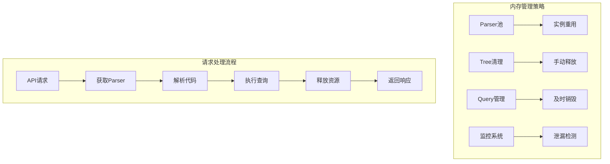

# 内存管理详细设计方案

## 问题分析

Tree-sitter原生Node.js绑定需要手动内存管理，主要涉及：
1. Parser实例的内存分配和释放
2. Tree实例的内存管理  
3. Query实例的生命周期管理
4. 防止内存泄漏的策略

## 内存管理架构



## 具体实现方案

### 1. Parser实例池管理

```typescript
// src/api/services/ParserPool.ts
import * as Parser from 'tree-sitter';

export class ParserPool {
    private pool: Map<string, Parser[]> = new Map();
    private maxPoolSize = 10;

    getParser(language: string): Parser {
        const languagePool = this.pool.get(language) || [];
        
        if (languagePool.length > 0) {
            return languagePool.pop()!;
        }

        return new Parser();
    }

    releaseParser(language: string, parser: Parser) {
        const languagePool = this.pool.get(language) || [];
        
        if (languagePool.length < this.maxPoolSize) {
            // 重置parser状态
            parser.setLanguage(null as any);
            languagePool.push(parser);
            this.pool.set(language, languagePool);
        } else {
            // 手动释放内存
            this.destroyParser(parser);
        }
    }

    private destroyParser(parser: Parser) {
        // 强制GC提示（Node.js没有直接的内存释放API）
        (parser as any).delete?.();
        // 置空引用帮助GC
        parser = null as any;
    }

    // 定期清理过期的parser
    cleanup() {
        this.pool.forEach((parsers, language) => {
            this.pool.set(language, []);
            parsers.forEach(parser => this.destroyParser(parser));
        });
    }
}
```

### 2. Tree实例生命周期管理

```typescript
// src/api/services/TreeManager.ts
export class TreeManager {
    private activeTrees: Set<any> = new Set();

    createTree(parser: Parser, code: string) {
        const tree = parser.parse(code);
        this.activeTrees.add(tree);
        return tree;
    }

    destroyTree(tree: any) {
        if (tree && typeof tree.delete === 'function') {
            tree.delete();
        }
        this.activeTrees.delete(tree);
    }

    // 请求结束时清理所有相关tree
    cleanupRequestTrees(trees: any[]) {
        trees.forEach(tree => this.destroyTree(tree));
    }

    // 紧急内存清理
    emergencyCleanup() {
        this.activeTrees.forEach(tree => {
            if (tree && typeof tree.delete === 'function') {
                tree.delete();
            }
        });
        this.activeTrees.clear();
    }
}
```

### 3. 完整的服务层实现

```typescript
// src/api/services/TreeSitterService.ts
import { ParserPool } from './ParserPool';
import { TreeManager } from './TreeManager';

export class TreeSitterService {
    private parserPool: ParserPool;
    private treeManager: TreeManager;
    private languageModules: Map<string, any> = new Map();

    constructor() {
        this.parserPool = new ParserPool();
        this.treeManager = new TreeManager();
        this.initializeLanguages();
    }

    private initializeLanguages() {
        // 动态导入语言模块
        const languages = {
            javascript: require('tree-sitter-javascript'),
            python: require('tree-sitter-python'),
            // ... 其他语言
        };

        Object.entries(languages).forEach(([lang, module]) => {
            this.languageModules.set(lang, module);
        });
    }

    async processRequest(request: ParseRequest): Promise<ParseResult> {
        const trees: any[] = [];
        
        try {
            const { language, code, query, queries = [] } = request;
            const languageModule = this.languageModules.get(language);
            
            if (!languageModule) {
                throw new Error(`Unsupported language: ${language}`);
            }

            // 从池中获取parser
            const parser = this.parserPool.getParser(language);
            parser.setLanguage(languageModule);

            // 解析代码
            const tree = this.treeManager.createTree(parser, code);
            trees.push(tree);

            // 执行查询
            const allQueries = query ? [query, ...queries] : queries;
            const matches = [];

            for (const q of allQueries) {
                const queryObj = tree.getLanguage().query(q);
                const queryMatches = queryObj.matches(tree.rootNode);
                
                matches.push(...queryMatches.flatMap(match => 
                    match.captures.map(capture => ({
                        captureName: capture.name,
                        type: capture.node.type,
                        text: capture.node.text,
                        startPosition: capture.node.startPosition,
                        endPosition: capture.node.endPosition
                    }))
                ));

                // 手动销毁query对象
                if (typeof queryObj.delete === 'function') {
                    queryObj.delete();
                }
            }

            return { success: true, matches, errors: [] };

        } catch (error) {
            return { success: false, matches: [], errors: [error.message] };
        } finally {
            // 确保资源释放
            this.treeManager.cleanupRequestTrees(trees);
            
            // 归还parser到池中
            if (parser) {
                this.parserPool.releaseParser(language, parser);
            }
        }
    }

    // 内存监控和清理
    monitorMemory() {
        const memoryUsage = process.memoryUsage();
        if (memoryUsage.heapUsed > 500 * 1024 * 1024) { // 500MB阈值
            this.emergencyCleanup();
        }
    }

    emergencyCleanup() {
        this.treeManager.emergencyCleanup();
        this.parserPool.cleanup();
    }
}
```

### 4. 内存监控中间件

```typescript
// src/api/middleware/memoryMonitor.ts
import { TreeSitterService } from '../services/TreeSitterService';

export const memoryMonitor = (service: TreeSitterService) => {
    return (req: Request, res: Response, next: NextFunction) => {
        // 监控内存使用
        service.monitorMemory();
        
        // 响应结束时检查内存
        res.on('finish', () => {
            const memoryUsage = process.memoryUsage();
            if (memoryUsage.heapUsed > 300 * 1024 * 1024) {
                console.warn('内存使用警告:', memoryUsage.heapUsed / 1024 / 1024, 'MB');
            }
        });

        next();
    };
};
```

### 5. 全局内存管理

```typescript
// src/api/utils/memoryUtils.ts
export class MemoryUtils {
    static forceGarbageCollection() {
        if (global.gc) {
            global.gc();
        } else {
            console.warn('Garbage collection is not exposed. Run with --expose-gc flag.');
        }
    }

    static getMemoryUsage() {
        return process.memoryUsage();
    }

    static logMemoryUsage(prefix: string = '') {
        const usage = this.getMemoryUsage();
        console.log(`${prefix} Memory - RSS: ${Math.round(usage.rss / 1024 / 1024)}MB, `
            + `Heap: ${Math.round(usage.heapUsed / 1024 / 1024)}MB`);
    }
}
```

## 部署和运行配置

### 启动脚本配置
```json
{
  "scripts": {
    "start": "node --expose-gc --max-old-space-size=2048 dist/server.js"
  }
}
```

### Docker内存限制
```dockerfile
# 设置内存限制
ENV NODE_OPTIONS="--max-old-space-size=2048"
```

## 监控和告警

### 健康检查端点
```typescript
app.get('/api/health', (req, res) => {
    const memory = process.memoryUsage();
    res.json({
        status: 'healthy',
        memory: {
            rss: Math.round(memory.rss / 1024 / 1024),
            heap: Math.round(memory.heapUsed / 1024 / 1024)
        }
    });
});
```

## 总结

这个内存管理方案提供了：
1. **Parser实例池**：重用parser减少创建开销
2. **Tree生命周期管理**：确保及时释放内存
3. **内存监控**：实时监控和预警
4. **紧急清理机制**：防止内存泄漏
5. **完整的错误处理**：确保资源释放

通过这套方案，可以有效管理Tree-sitter原生绑定的内存使用，防止内存泄漏，确保API的稳定运行。