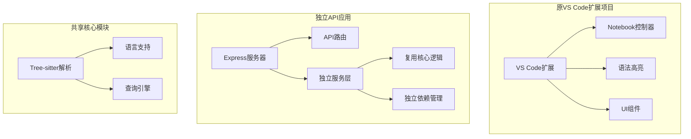

# 独立API应用架构设计

## 架构分离策略



## 完全独立的设计方案

### 1. 项目结构分离

**推荐的项目结构：**
```
tree-sitter-api/          # 独立API项目
├── src/
│   ├── server.ts         # Express服务器
│   ├── routes/           # API路由
│   ├── services/         # 业务服务
│   ├── utils/            # 工具函数
│   └── types/            # 类型定义
├── package.json          # 独立依赖
└── tsconfig.json        # 独立配置

tree-sitter-extension/    # 原VS Code扩展
├── src/
│   ├── extension.ts      # VS Code扩展入口
│   ├── controller.ts     # Notebook控制器
│   └── ...              # 其他扩展文件
└── package.json         # 扩展依赖
```

### 2. 依赖管理独立

**API项目package.json:**
```json
{
  "name": "tree-sitter-api",
  "version": "1.0.0",
  "dependencies": {
    "express": "^4.18.0",
    "cors": "^2.8.5",
    "body-parser": "^1.20.0",
    "web-tree-sitter": "^0.25.10"
  },
  "devDependencies": {
    "@types/express": "^4.17.0",
    "typescript": "^5.0.0"
  }
}
```

### 3. 核心逻辑复用策略

#### 方案1: 源码级别复用
```typescript
// API项目中的treeSitterService.ts
import { Parser } from 'web-tree-sitter';

// 复制原项目的核心逻辑
const SUPPORTED_LANGUAGES = {
    javascript: 'JavaScript',
    typescript: 'TypeScript',
    python: 'Python',
    java: 'Java',
    go: 'Go',
    csharp: 'C#',
    cpp: 'C++',
    rust: 'Rust',
    ruby: 'Ruby'
};

function getWasmLanguage(languageId: string) {
    switch (languageId) {
        case 'javascript': return 'tree-sitter-javascript';
        case 'typescript': return 'tree-sitter-typescript';
        // ... 其他语言映射
        default: throw new Error(`Unsupported language: ${languageId}`);
    }
}
```

#### 方案2: 包级别复用（推荐）
将核心逻辑提取为独立的NPM包：

```bash
# 创建核心包
mkdir tree-sitter-core
cd tree-sitter-core
npm init
```

**核心包结构：**
```
tree-sitter-core/
├── src/
│   ├── parser.ts         # 解析逻辑
│   ├── queryEngine.ts    # 查询引擎
│   ├── languageLoader.ts # 语言加载
│   └── types.ts          # 类型定义
├── package.json
└── tsconfig.json
```

两个项目都依赖这个核心包：
```json
{
  "dependencies": {
    "tree-sitter-core": "file:../tree-sitter-core"
  }
}
```

### 4. 构建和部署独立

**API项目构建脚本：**
```json
{
  "scripts": {
    "build": "tsc",
    "start": "node dist/server.js",
    "dev": "ts-node-dev src/server.ts"
  }
}
```

**独立Docker配置：**
```dockerfile
FROM node:18-alpine
WORKDIR /app
COPY package*.json ./
RUN npm install
COPY . .
RUN npm run build
EXPOSE 3000
CMD ["npm", "start"]
```

### 5. 配置管理独立

**环境配置：**
```typescript
// config.ts
export const config = {
    port: process.env.PORT || 3000,
    maxRequestSize: process.env.MAX_REQUEST_SIZE || '10mb',
    supportedLanguages: ['javascript', 'typescript', 'python', 'java', 'go', 'csharp', 'cpp', 'rust', 'ruby']
};
```

### 6. 测试策略独立

**API项目测试结构：**
```
__tests__/
├── unit/
│   ├── services/
│   └── utils/
├── integration/
│   └── api/
└── e2e/
    └── scenarios/
```

### 7. 监控和日志独立

**独立日志系统：**
```typescript
import winston from 'winston';

export const logger = winston.createLogger({
    level: 'info',
    format: winston.format.json(),
    transports: [
        new winston.transports.File({ filename: 'error.log', level: 'error' }),
        new winston.transports.File({ filename: 'combined.log' })
    ]
});
```

## 优势分析

### 完全独立的优势
1. **部署灵活性**: API可以单独部署，不依赖VS Code环境
2. **资源隔离**: 独立的进程和内存管理
3. **扩展性**: 可以水平扩展API实例
4. **技术栈自由**: 可以使用最适合API的技术栈
5. **维护简单**: 代码库更小，更易于维护

### 复用核心逻辑的优势
1. **代码一致性**: 共享相同的解析和查询逻辑
2. **功能同步**: 新功能可以同时应用到扩展和API
3. **测试覆盖**: 共享的测试用例
4. **知识共享**: 开发团队可以共享领域知识

## 迁移步骤

### 阶段1: 代码分析
1. 识别可复用的核心逻辑
2. 分析依赖关系
3. 设计接口契约

### 阶段2: 核心包创建
1. 创建独立的核心包
2. 迁移核心逻辑
3. 设置构建和发布流程

### 阶段3: API项目开发
1. 初始化API项目
2. 集成核心包
3. 实现REST端点

### 阶段4: 扩展项目重构
1. 更新扩展项目使用核心包
2. 移除重复代码
3. 测试兼容性

## 持续集成

**独立的CI/CD流水线：**
```yaml
# API项目CI配置
name: API CI/CD
on:
  push:
    branches: [main]
jobs:
  test:
    runs-on: ubuntu-latest
    steps:
      - uses: actions/checkout@v3
      - run: npm install
      - run: npm test
  
  deploy:
    needs: test
    runs-on: ubuntu-latest
    steps:
      - uses: actions/checkout@v3
      - run: npm install
      - run: npm run build
      - run: docker build -t tree-sitter-api .
      - run: docker push tree-sitter-api
```

## 总结

通过完全独立的架构设计，API应用可以：
1. 独立于VS Code扩展进行开发和部署
2. 复用核心的Tree-sitter逻辑确保功能一致性
3. 实现更好的可扩展性和性能特性
4. 简化维护和升级流程

这种架构既保持了功能的统一性，又提供了部署的灵活性。